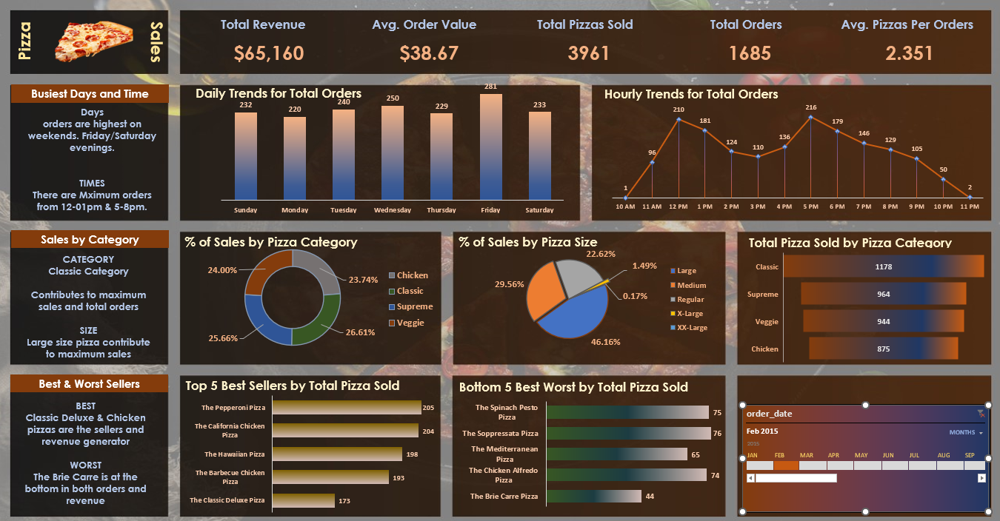

# 🍕 Pizza Sales Analysis – SQL & Excel Dashboard

## 📌 Project Overview

This project analyzes pizza sales data using **SQL** for querying and **Excel** for visualization. The main goal is to uncover insights on customer ordering behavior, sales trends, and product performance. A professional interactive dashboard was designed in Excel to present key findings.

---

## 🎯 Objectives

* Track **total revenue, orders, and pizzas sold**
* Analyze **daily & hourly sales trends**
* Identify **busiest days and times** for orders
* Compare sales across **pizza categories and sizes**
* Find **best & worst-selling pizzas**
* Build a **professional dashboard** for business insights

---

## 🛠️ Tools Used

* **SQL Server** → Data cleaning, transformation & querying
* **Excel** → Dashboard creation with charts, slicers & formatting

---

## 📊 Key Insights

* **Revenue:** $65,160 with **3,961 pizzas sold** across **1,685 orders**
* **Avg. Order Value:** $38.67 | **Avg. Pizzas/Order:** 2.35
* **Busiest Days:** Friday & Saturday evenings (12–1 PM and 5–8 PM peak hours)
* **Top Category:** Classic pizzas generated the highest sales
* **Top Size:** Large pizzas contributed the most revenue
* **Best Sellers:**

  * 🥇 Pepperoni Pizza
  * 🥈 California Chicken Pizza
  * 🥉 Hawaiian Pizza
* **Worst Sellers:** Brie Carre Pizza, Spinach Pesto Pizza

---

## 📈 Dashboard Preview



---

## 🗂️ Dataset

The dataset contains order-level details such as:

* **Order Date & Time**
* **Pizza Category & Size**
* **Quantity Sold**
* **Revenue per Order**

Source: *pizza_sales excel file.xlsx*

---

## 🔎 Sample SQL Queries

**1. Total Revenue**

```sql
SELECT SUM(total_price) AS Total_Revenue
FROM pizza_sales;
```

**2. Average Order Value**

```sql
SELECT SUM(total_price) / COUNT(DISTINCT order_id) AS Avg_Order_Value
FROM pizza_sales;
```

**3. Daily Trend for Orders**

```sql
SELECT DATENAME(DW, order_date) AS Day, COUNT(order_id) AS Total_Orders
FROM pizza_sales
GROUP BY DATENAME(DW, order_date);
```

**4. Sales by Pizza Category**

```sql
SELECT pizza_category, SUM(total_price) AS Revenue, COUNT(order_id) AS Orders
FROM pizza_sales
GROUP BY pizza_category;
```

---

## 🚀 How to Use

1. Clone this repo
2. Import `pizza_sales excel file.xlsx` into SQL Server or Excel
3. Run the SQL scripts for analysis
4. Open the Excel file to explore the dashboard

---

## 📌 Future Improvements

* Build an **interactive Power BI dashboard**
* Add **customer demographics & loyalty analysis**
* Use **Python for advanced analytics & forecasting**

---

## 💡 Conclusion

This project demonstrates how SQL and Excel can be combined to perform powerful sales analysis and deliver actionable business insights.

---

👨‍💻 **Created by:** NAKUL

